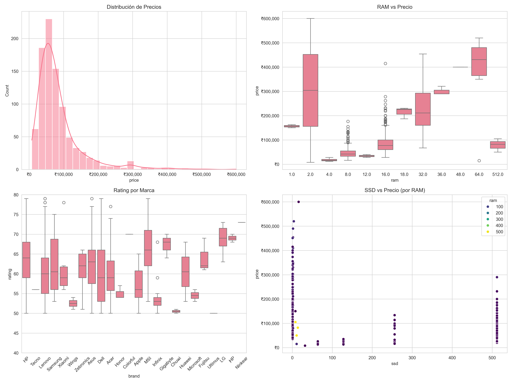

# 🖥️ Análisis de Portátiles - Precios y Especificaciones



Análisis exploratorio completo de un dataset de portátiles que examina las relaciones entre precios, especificaciones técnicas y ratings de productos del mercado indio.

## 📊 Características del Dataset

- **Registros:** 920 portátiles
- **Variables:** Precio, RAM, SSD, Rating, Marca, Modelo
- **Origen:** Mercado indio de portátiles
- **Formato:** CSV

## 🚀 Características del Proyecto

- 🧹 **Limpieza y normalización** de datos
- 📊 **Análisis exploratorio completo** (EDA)
- 📈 **Visualizaciones interactivas** en Jupyter Notebook
- 🎮 **Segmentación por categorías** (Gaming, Apple, Ultrabook, General)
- 📝 **Informe ejecutivo** con hallazgos clave
- 🔍 **Análisis de correlaciones** entre variables

## 📁 Estructura del Proyecto

```
Portatiles/
├── data/
│   └── laptop.csv              # Dataset principal
├── notebooks/
│   └── Laptop_Analysis.ipynb   # Notebook de análisis
├── scripts/
│   └── laptop_analysis.py      # Script de análisis automatizado
├── reports/
│   └── images/                 # Visualizaciones generadas
├── requirements.txt            # Dependencias de Python
└── README.md                   # Este archivo
```

## 🛠️ Instalación y Uso

### Prerrequisitos

- Python 3.7+
- pip (gestor de paquetes de Python)

### Instalación

1. **Clonar el repositorio:**
```bash
git clone https://github.com/tu-usuario/analisis-portatiles.git
cd analisis-portatiles
```

2. **Instalar dependencias:**
```bash
pip install -r requirements.txt
```

3. **Ejecutar el análisis:**
```bash
python scripts/laptop_analysis.py
```

### Uso del Notebook

Para un análisis interactivo, abre el notebook en Jupyter:

```bash
jupyter notebook notebooks/Laptop_Analysis.ipynb
```

## 📈 Hallazgos Principales

### 1. Relaciones de Precio
- **RAM vs Precio:** Correlación moderada positiva (0.18)
- **SSD vs Precio:** Correlación negativa moderada (-0.49)
- **Rating vs Precio:** Correlación débil negativa (-0.14)

### 2. Marcas Destacadas
- **Lenovo:** Mayor cantidad de modelos (217)
- **HP:** Segunda posición (175 modelos)
- **Asus:** Tercera posición (132 modelos)

### 3. Categorías de Productos
- **General:** 533 modelos (57.9%)
- **Gaming:** 237 modelos (25.8%)
- **Ultrabook:** 132 modelos (14.3%)
- **Apple:** 18 modelos (2.0%)

### 4. Estadísticas de Precio
- **Precio promedio:** ₹85,053
- **Precio mediano:** ₹64,990
- **Rango:** ₹8,000 - ₹599,990

## 📊 Visualizaciones Generadas

El proyecto genera automáticamente las siguientes visualizaciones:

- `correlation_matrix.png` - Matriz de correlación entre variables
- `brands_count.png` - Top 10 marcas por cantidad de modelos
- `main_analysis.png` - Análisis principal con 4 gráficos
- `price_by_category.png` - Distribución de precios por categoría

## 🔍 Metodología

### Limpieza de Datos
1. Eliminación de símbolos monetarios (₹) y comas
2. Extracción de valores numéricos de RAM y SSD
3. Normalización de nombres de columnas
4. Manejo de valores faltantes
5. Corrección y estandarización de marcas

### Análisis Exploratorio
1. Estadísticas descriptivas
2. Matriz de correlación
3. Análisis de distribución por marcas
4. Segmentación por categorías
5. Identificación de patrones y outliers

## 📝 Conclusiones

1. **Componentes y Precio:** La RAM tiene una relación positiva moderada con el precio, mientras que el SSD muestra una correlación negativa inesperada.

2. **Mercado Concentrado:** Las tres principales marcas (Lenovo, HP, Asus) representan más del 50% del mercado.

3. **Segmentación Clara:** El mercado se divide claramente entre portátiles generales, gaming y ultrabooks, cada uno con características de precio distintivas.

4. **Calidad vs Precio:** La relación entre rating y precio es débil, sugiriendo que el precio no necesariamente refleja la calidad percibida.

## 👨‍💻 Autor 

**Tu Nombre**
- GitHub: Josue Gamboa
## 🙏 Agradecimientos

